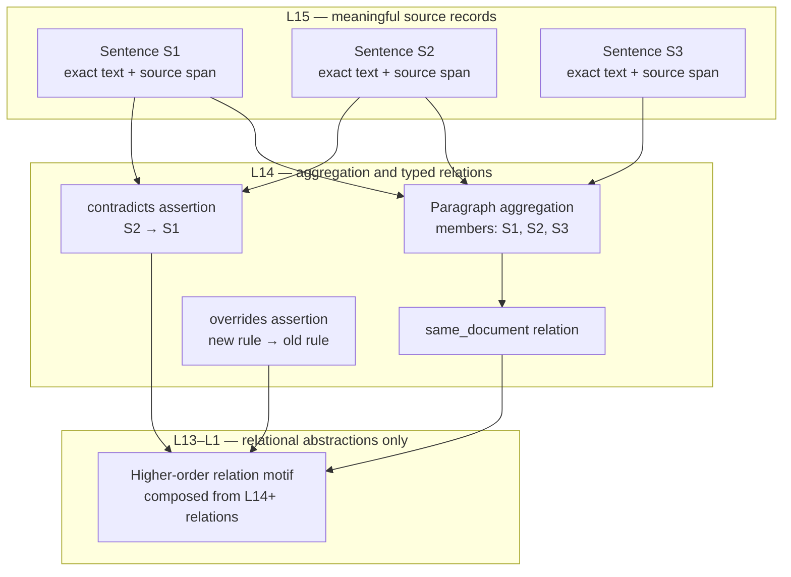

# BaryGraph Architecture Specification
## Version 1.0 — General-Purpose Layered Knowledge Graph

**Status:** Architecture baseline  
**Supersedes:** BaryGraph Kaikki PoC v0.6 as the general architectural reference  
**Date:** September 2026

> **Core design decision:** BaryGraph separates meaningful source content from typed aggregation and from higher-order relational structure. L15 stores the meaningful, retrievable data. L14 groups or typizes that data into explicit relationship objects. L13 and above are constructed only from relations: they recursively aggregate lower-level relation objects through a bridge relation. A corpus-specific ingestion adapter may populate L15/L14, but must not redefine this layer contract.

---

## 1. Purpose and scope

BaryGraph is a layered graph architecture for representing information at multiple scales while keeping the source-bearing data distinct from the structures inferred or declared between it.

The architecture is intended for documentation, research, policy, legal material, knowledge bases, and other corpora in which content can be segmented and relationships can be represented. Its purpose is not merely to find text that is semantically similar. It is to preserve provenance, expose typed relationships, and construct higher-order relational context that can connect otherwise separate topics.

Version 1.0 establishes the general model and its terminology. It does not mandate a particular database, embedding provider, parser, or extraction model. Those are implementation choices behind stable interfaces.

### 1.1 Architectural goals

1. Preserve meaningful source units at the leaf level, including exact text and provenance.
2. Represent aggregation and relationship typing explicitly rather than burying them in labels or vectors.
3. Build higher-level abstractions recursively from relations, not by re-embedding or rewriting the source at every level.
4. Support multiple corpora and domain-specific relation vocabularies through adapters and registries.
5. Allow every derived object to be traced to its inputs, source spans, extraction method, and version.
6. Make uncertainty and disagreement representable; do not convert uncertain inference into unqualified fact.

### 1.2 Non-goals

- Replacing source documents or their authoritative interpretation.
- Treating embedding similarity as proof of a relationship.
- Requiring every corpus to use sentence-sized L15 records or a universal relation taxonomy.
- Assuming every node must have one parent, or that the complete graph is a strict forest.
- Prescribing one scoring equation, vector model, storage engine, or extraction model as universal.

---

## 2. The layer contract

BaryGraph uses levels L1 through L15. L15 is the most concrete and source-proximate layer; level numbers decrease as abstractions become broader. The key invariant for v1.0 is the distinction among three architectural zones:

| Zone | Levels | Architectural role | Content rule |
|---|---:|---|---|
| Meaningful-data layer | L15 | Source-bearing knowledge units | Store meaningful records with content, provenance, and modality-specific payloads. |
| Aggregation and typization layer | L14 | Typed relation / aggregation objects | Name and type relationships among L15 objects (or L14 relation objects where explicitly allowed). |
| Relational abstraction layers | L13–L1 | Higher-order relational structure | Construct only from relations and their relations; do not introduce new source facts here. |

L1–L13 are not required to be populated. A graph may stop at any level supported by its data and use case. Empty levels are not errors and must not be filled with arbitrary placeholders merely to appear complete.

### 2.1 L15: meaningful records

An L15 object is a meaningful unit whose content is independently interpretable and traceable to source material. Examples include:

- a sentence or sentence-like statement from a document;
- a paragraph, if the paragraph is the chosen atomic unit for a corpus;
- a table row, figure caption, code block, event, observation, or database record;
- a dictionary sense or a domain-specific assertion.

For prose documentation, the recommended default is **one sentence per L15 node**, retaining the containing paragraph and document identifiers as provenance/context. The paragraph is a segmentation and grouping unit; it need not itself be a graph node. Where a sentence is not independently meaningful (for example, a list item continuation), the adapter may use a larger span or create a linked context record. Segmentation policy must be documented and stable within a dataset version.

L15 stores the actual payload, not merely an embedding or a summary. Embeddings are optional derived indexes. A stored sentence should retain the exact source text, document and paragraph references, offsets/page coordinates when available, language, and ingestion metadata.

### 2.2 L14: aggregation and typization

L14 represents relationships and meaningful aggregations over L15 data. An L14 object makes explicit:

- which records or lower-level relations participate;
- what relation or aggregation type is being asserted;
- whether the relationship is asserted by the source, extracted, inferred, or curated;
- supporting evidence and confidence;
- the scope and provenance of the assertion.

A paragraph containing several sentences may induce one or more L14 objects. For example, it can identify a set of sentence nodes as belonging to the same paragraph/document, and express typed links such as `contradicts`, `supports`, `same_document`, `overrides`, or `refines`. These are separate assertions with distinct evidence and directionality. A paragraph does **not** automatically imply that every sentence pair is related by every available type.

L14 is therefore not simply a “word level” or a generic container level. It is the boundary at which the corpus adapter's semantic relation vocabulary becomes explicit in the graph.

### 2.3 L13–L1: relation-only construction

Above L14, objects are constructed from already-existing relations. They may aggregate related L14 assertions or higher-level relational objects into higher-order motifs, pathways, clusters, or bridges. Their inputs are relations; they do not directly absorb raw source text as a new fact.

A higher-level object may retain references to source evidence for explainability, but its immediate construction inputs remain lower-level relation objects. This keeps the abstraction chain inspectable: source record → typed relation/aggregation → higher-order relational structure.

The legacy MetaBary triad is one possible construction primitive for this zone, not the definition of all higher-level objects. A v1.0 implementation may use a triad, a typed hyperedge, a cluster, a path motif, or another registered relation-composition operator, provided the operator records its inputs and semantics.

---

## 3. Example: ingesting documentation

Consider a document with paragraphs P1 and P2. P1 contains sentences S1, S2, and S3.

1. Parse the document while preserving document identity, version, paragraph boundaries, sentence spans, and offsets.
2. Create L15 nodes for S1, S2, and S3. Their text is the primary payload; each points to the source document and paragraph.
3. Create L14 aggregation/relationship objects as warranted. A `same_paragraph` relation can group S1–S3; `same_document` can link P1 and P2 or their member statements. If S2 conflicts with S1, create a directed or symmetric `contradicts` assertion with evidence. If a later paragraph replaces an earlier rule, use a directed `overrides` relation from the replacing statement to the superseded one. Do not infer any of these solely from shared paragraph membership.
4. Compose L14 relations into higher-level objects at L13 and above. For example, multiple `overrides` links can form a policy-evolution motif; a `contradicts` relation may connect two otherwise distant topic clusters.
5. Every derived object resolves back through its inputs to exact source spans and document versions.

Illustrative structure:



The diagram is illustrative: a relation object can have more than two participants, and an aggregation may be a hyperedge or membership object rather than a binary edge.

---

## 4. BaryGraph objects and terminology

Version 1.0 distinguishes object roles rather than forcing all objects into a single `node`/`baryedge` dichotomy.

### 4.1 SourceRecord

A source-proximate L15 object containing a meaningful payload and provenance. It may represent text, a structured record, media segment, or other corpus unit.

### 4.2 Relation

An explicit assertion that relates one or more participants under a registered relation type. Most corpus-level relations are represented at L14. A relation has directionality, evidence, provenance, and confidence semantics. Binary relations have two participants; n-ary relations use a participant list with roles.

### 4.3 Aggregation

An object that groups members under a structural criterion (e.g. paragraph, section, same document, table, event episode). Aggregation membership is not automatically a semantic claim such as support or contradiction. Aggregations may be represented as a dedicated object, typed relation, or hyperedge, according to storage implementation.

### 4.4 RelationalAbstraction

A derived object at L13–L1 whose immediate inputs are lower-level relations or relational abstractions. It represents a reusable pattern or larger-scale relation structure. It must record the composition operator and all input references.

### 4.5 BaryEdge and MetaBary

The v0.6 terms remain available as implementation primitives:

- **BaryEdge**: a relation/aggregation object constructed from participants and a relation type, traditionally with a barycentric vector.
- **MetaBary**: a higher-level relational abstraction constructed recursively from lower-level BaryEdges, optionally using a bridge relation.

In v1.0, these names describe object forms, not mandatory levels or universal semantics. A database may retain `baryedge` as a physical `doc_type`, while exposing generalized logical roles in the API.

---

## 5. Relation type system

Relation types are registered, versioned schema terms—not free-form labels. Each type definition specifies its meaning and operational behavior.

A relation type should declare:

- stable `type_id` and human-readable label;
- definition and examples / counterexamples;
- arity (binary, n-ary, membership, or unrestricted);
- directionality (directed, symmetric, or role-based);
- permitted participant roles and levels;
- whether the relation is source-asserted, extracted, inferred, or curated;
- evidence requirements and confidence interpretation;
- whether inverse relations are defined;
- composition rules, if any;
- schema version and deprecation/migration status.

### 5.1 General-purpose starter vocabulary

| Type | Typical direction | Meaning / caution |
|---|---|---|
| `same_document` | symmetric or membership | Participants share a document identity/version. Usually better represented by shared document membership than all-pairs links. |
| `same_paragraph` | symmetric or membership | Participants occur in the same paragraph. Indicates proximity, not entailment. |
| `supports` | directed | Evidence in source A supports claim B; preserve evidence span. |
| `contradicts` | usually symmetric | Content is incompatible under a stated scope or interpretation. Record scope and evidence. |
| `overrides` | directed: newer/replacing → replaced | One statement supersedes another under a defined authority/time scope. |
| `refines` | directed: narrower → broader or vice versa, fixed by registry | One statement narrows, qualifies, or elaborates another. Specify direction convention. |
| `defines` | directed: definition → defined term | A source unit defines a term or concept. |
| `cites` | directed: citing → cited | Documentary citation or explicit reference. |
| `derived_from` | directed: result → source | Provenance or derivation link. |
| `instance_of` | directed: instance → class | Classification relation. |
| `part_of` | directed: part → whole | Structural membership with domain-specific constraints. |
| `related_to` | symmetric, weak | Use only when a more precise relation is unavailable; avoid as a catch-all during evaluation. |

Names such as `same_document` can be modeled as metadata or membership rather than pairwise edges to avoid quadratic edge growth. The logical relation is stable even if its physical representation changes.

### 5.2 Distinguish relation from evidence

A relation assertion and the evidence supporting it are different objects/fields. For example, an extracted `contradicts` relation should identify both claim participants and the sentence spans / rule used to justify the extraction. A confidence score is not a substitute for evidence, and a high embedding similarity is not evidence of contradiction or support.

---

## 6. Logical data model

The following is a logical schema. Implementations may normalize or denormalize it, but must preserve the semantics.

### 6.1 SourceRecord (L15)

```json
{
  "id": "stable-id",
  "object_kind": "source_record",
  "level": 15,
  "record_type": "sentence",
  "payload": {"text": "Exact source text."},
  "provenance": {
    "source_id": "doc-123",
    "source_version": "rev-7",
    "locator": {"paragraph": 4, "sentence": 2, "char_start": 812, "char_end": 901},
    "uri": "optional-source-uri"
  },
  "context_refs": ["paragraph-4", "section-2"],
  "language": "en",
  "derived": {"embedding_ref": "optional", "parser_version": "..."},
  "created_at": "...",
  "schema_version": "1.0"
}
```

`payload` is modality-specific. Avoid storing only an embedding or generated summary where the source payload is available. Large payloads may be externalized with content hash and durable reference.

### 6.2 Relation / Aggregation (typically L14)

```json
{
  "id": "stable-id",
  "object_kind": "relation",
  "level": 14,
  "type_id": "contradicts",
  "participants": [
    {"ref": "statement-new", "role": "claim_a"},
    {"ref": "statement-old", "role": "claim_b"}
  ],
  "assertion": {
    "status": "extracted",
    "confidence": 0.86,
    "scope": "same-policy-version-and-condition"
  },
  "evidence": [{"ref": "source-record-1", "span": {"start": 0, "end": 40}}],
  "provenance": {"method": "extractor-name", "method_version": "...", "source_id": "doc-123"},
  "vector_ref": "optional",
  "created_at": "...",
  "schema_version": "1.0"
}
```

An aggregation uses `object_kind: "aggregation"`, an aggregation type, and `members` or participant roles. It may share the same physical collection as relations, but should not be semantically confused with an assertion.

### 6.3 RelationalAbstraction (L13–L1)

```json
{
  "id": "stable-id",
  "object_kind": "relational_abstraction",
  "level": 13,
  "operator_id": "triadic_bridge_v1",
  "inputs": ["relation-a", "relation-b", "relation-bridge"],
  "result_type": "policy-conflict-motif",
  "construction": {"parameters": {}, "algorithm_version": "..."},
  "score": {"value": 0.74, "meaning": "operator-specific; not universal confidence"},
  "vector_ref": "optional",
  "created_at": "...",
  "schema_version": "1.0"
}
```

Do not overload a single `weight` field to mean extraction confidence, semantic similarity, relation strength, and hierarchy authority. Store distinct, documented quantities.

---

## 7. Construction rules

### 7.1 Invariants

1. **L15 is source-bearing.** Every source-derived L15 record has a stable source reference and a content payload or an explicit external payload reference.
2. **L14 is typed.** Every L14 relation/aggregation references a registered type or explicitly declares an extension namespace and version.
3. **Higher levels are relational.** L13–L1 objects are constructed from L14+ relation objects; raw source records may be referenced for explanation but are not direct construction inputs under the default profile.
4. **No implicit semantics from co-location.** Shared paragraph/document membership does not entail support, contradiction, equivalence, or any other semantic relation.
5. **Provenance is transitive.** Every derived object can be traced through its inputs to source records and versions.
6. **Uncertainty is explicit.** Assertions distinguish source-asserted, extracted, inferred, and human-curated status; unknown is not false.
7. **Type semantics are versioned.** Changing a relation type's meaning requires a new schema version or migration.
8. **No universal single-parent requirement.** Multiple relations and multiple higher-level abstractions may refer to the same source record unless an application-specific constraint is declared.
9. **Cycles are handled by operator policy.** Source relations may be cyclic. Derived composition operators must specify whether cycles are allowed, collapsed, or excluded.
10. **Vectors are auxiliary.** Vector presence or similarity never changes the truth status of a relation.

### 7.2 Relation composition

A composition operator defines eligible input types/levels, output level/type, directionality rules, optional similarity constraints, scoring behavior, and explainability requirements. It must be deterministic for a given input snapshot and parameter version, or record its randomness/seed.

The legacy MetaBary pattern can be registered as a composition operator: two related child relations and a bridge relation yield a higher-level relation object. The operator's vector and weight equations are implementation-specific and must be evaluated independently. The v0.6 formula is not inherited as a normative v1.0 truth rule.

### 7.3 Level assignment

Levels express architectural role and abstraction, not a universal ontology. L15 and L14 have the cross-domain meanings specified here. For L13–L1, each deployment documents its level policy and stopping criteria. A level shift must not silently change object semantics.

---

## 8. Ingestion pipeline

A corpus adapter transforms source material into the logical model. Recommended stages:

1. **Register source and version.** Compute stable source identity and content hash; record rights/access controls.
2. **Parse structure.** Extract document/section/paragraph boundaries, tables, lists, and modality-specific units.
3. **Segment meaningful records.** Create L15 records according to a declared segmentation policy; preserve exact spans and context references.
4. **Extract typed relations and aggregations.** Create L14 assertions only when supported by source evidence or an explicitly declared inference policy.
5. **Validate.** Check participant references, type constraints, direction conventions, evidence links, schema version, and duplicate/idempotency keys.
6. **Construct higher-order relations.** Run registered composition operators over eligible L14+ objects; record inputs and operator version.
7. **Index.** Build lexical, vector, and graph indexes as derived infrastructure, not as the source of truth.
8. **Evaluate and publish.** Run corpus-specific quality gates before exposing the graph to users.

Pipeline stages should be resumable and idempotent. Reprocessing a document version must either update a clearly identified snapshot or create a new version; it must not silently mix incompatible versions.

---

## 9. Retrieval and explanation

BaryGraph supports several complementary retrieval modes:

- **Content retrieval:** search L15 payloads by lexical or vector methods.
- **Typed relation retrieval:** query L14 by type, participant, source, time/version, confidence class, or evidence.
- **Relational retrieval:** find L13–L1 abstractions and expand their construction inputs.
- **Evidence-grounded explanation:** present an abstraction together with its relation chain and source spans.

A result should identify whether it is a source statement, an asserted relation, an extracted/inferred relation, or a derived abstraction. UI and API clients should not display a derived abstraction as if it were a verbatim source fact.

### 9.1 Explainability payload

For each derived result, return at minimum:

- object ID, level, type/result type;
- operator and version;
- direct input IDs and their roles;
- relation status/confidence semantics;
- source references and evidence spans reachable from the inputs;
- any filters, thresholds, or ranking scores used to retrieve it.

---

## 10. Storage and indexing

The architecture is storage-agnostic. A relational database, document database, graph database, or hybrid system can implement the logical schema. Core requirements are stable identifiers, referential integrity or integrity checks, efficient participant-to-relation lookup, version-aware provenance, and reproducible derived-object construction.

Recommended index families:

- source identity + version + locator;
- object kind + level + type ID;
- participant reference (reverse adjacency);
- provenance source and extraction method/version;
- status and confidence bucket, where semantically meaningful;
- optional vector index scoped by object kind, level, and corpus.

Avoid materializing all-pairs `same_document` edges for large documents. Use shared membership records, adjacency lists, or query-time joins. Vector indexes are rebuildable derived artifacts and must be tied to embedding model/version and payload normalization policy.

---

## 11. Quality, evaluation, and operational controls

Evaluation is corpus-specific, but v1.0 requires separate checks for each architectural zone.

| Zone | Evaluation examples |
|---|---|
| L15 | Segmentation coverage, source-span accuracy, payload fidelity, duplicate rate, version integrity |
| L14 | Relation-type precision/recall on annotated samples, direction correctness, evidence sufficiency, calibration, unsupported-claim rate |
| L13–L1 | Composition validity, provenance completeness, stability under reprocessing, useful relational retrieval, expert-rated explanation quality |
| End-to-end | Retrieval success, latency, update correctness, access control, reproducibility |

Report uncertainty and dataset coverage. A graph with fewer, evidence-backed relations may be preferable to a dense graph of weakly supported assertions. Benchmark similarity retrieval separately from typed-relation accuracy and higher-order bridge usefulness; these measure different capabilities.

Operationally, track parser/extractor/operator versions, ingestion counts, validation failures, orphan/unlinked rates, relation-type distributions, composition survival by level, and stale-source propagation. Metrics need definitions and denominators; a bare orphan percentage is not interpretable without explaining which objects are eligible for parentage.

---

## 12. Security, privacy, and lifecycle

Access policy applies to source records and must propagate to derived relations and abstractions. A derived object must not reveal restricted source content through payload, evidence, or retrieval expansion. Deletion, correction, or access changes to a source version must trigger a documented invalidation/rebuild policy for dependent objects and indexes.

Keep immutable source-version identity separate from mutable current-document pointers. Record retention and audit requirements at the deployment layer. Personally identifiable or otherwise sensitive data requires corpus-specific minimization, authorization, and logging controls.

---

## 13. Migration from v0.6

The v0.6 Kaikki PoC remains a useful concrete implementation and empirical case study. Version 1.0 generalizes its architecture; it does not erase its domain assumptions.

| v0.6 concept | v1.0 interpretation |
|---|---|
| L15 sense node | One possible L15 SourceRecord; for documentation, commonly a sentence or meaningful span |
| L14 word node | Not a universal L14 requirement; replace with corpus-specific aggregation/typed relation objects |
| L14 BaryEdge / `edge_type` | A typed Relation or Aggregation with explicit evidence and provenance |
| L13+ MetaBary | One registered relational-composition operator among potentially several |
| `parent_edge_id` unique-parent forest | Optional application-specific topology constraint; not a general invariant |
| `connection_strength`, `accumulated_weight` | Separate operator-specific scores; define semantics before reuse |
| `bary_vec` / `meta_bary` | Optional derived vectors with model and construction metadata |
| Kaikki relation priorities and `q_seed` | Kaikki adapter policy only; not general-purpose defaults |
| Kaikki live counts and benchmarks | Historical PoC observations, not v1.0 guarantees |

A migration should map old `node` records to SourceRecord or domain entities as appropriate, map BaryEdges to typed Relation/Aggregation records, and map MetaBary documents to RelationalAbstractions with explicit operator/version and input references. Preserve original IDs where feasible, while assigning a stable `object_kind` and schema version. Do not infer missing provenance or type semantics during migration; mark unknown fields as unknown and document assumptions.

---

## 14. Extension points

- corpus-specific adapters and segmentation policies;
- domain relation registries and schema namespaces;
- multiple relation-composition operators;
- n-ary relations and hyperedges;
- temporal validity, authority, jurisdiction, and document version semantics;
- multilingual and multimodal payloads;
- human review and correction workflows;
- graph/vector/keyword hybrid retrieval;
- non-forest and cross-cutting structures.

Extensions must preserve the L15/L14/higher-level contract or explicitly declare a profile that revises it.

---

## 15. Open design decisions for the next revision

1. Whether L14 aggregation should be a first-class object kind or a registered relation subtype in the canonical API.
2. Whether paragraph/document membership is represented through membership objects, metadata, or typed hyperedges in the reference implementation.
3. A reference relation registry and namespace/version policy.
4. A standard evidence representation for text, tables, images, and time-based media.
5. A reference composition-operator interface, including deterministic scoring and explainability contracts.
6. Whether a formal profile will retain the v0.6 unique-parent forest for selected deployments.
7. Reference storage backend and API contract.
8. A cross-corpus benchmark for source-grounded relational retrieval and bridge explanation.

---

## 16. Version 1.0 acceptance checklist

- [x] L15 defined as the meaningful, source-bearing data layer.
- [x] L14 defined as aggregation and relation-typization layer.
- [x] L13–L1 defined as relation-only construction layers.
- [x] Documentation ingestion example specified with sentence-level L15 and paragraph-aware aggregation.
- [x] `same_document`, `contradicts`, and `overrides` treated as distinct typed structures, not inferred from proximity.
- [x] Source provenance, evidence, uncertainty, and schema/operator versioning included.
- [x] v0.6-specific assumptions separated from general invariants.
- [x] Storage, retrieval, evaluation, migration, and extension points defined.

---

*BaryGraph Architecture Specification v1.0 · September 2026*
