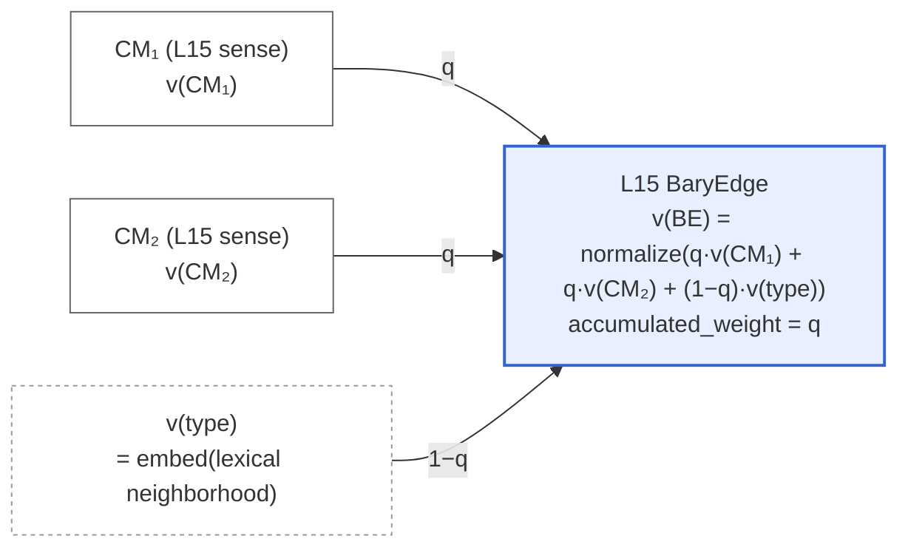
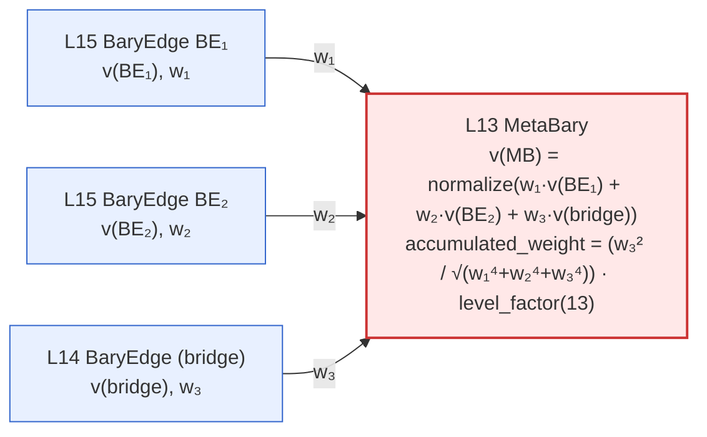

# BaryGraph PoC: English Kaikki Dictionary
## A Local-First Proof of Concept for Cross-Domain Relational Retrieval
**Version 0.6 · May 2026**

> **v0.6 changes from v0.5:**
> - **Primary objective restated.** BaryGraph's design goal is
>   *cross-domain relational retrieval* — surfacing structural bridges
>   between concepts that flat vector search cannot construct. The kaikki
>   corpus is the test application, not the architectural claim. Language
>   is chosen because it is corpus-agnostic in form, has clean test
>   methodology, and has explicable results.
> - **LLM `registry.summary` / `summary_vector` removed.** The original
>   plan for asynchronous one-sentence LLM summaries per BaryEdge with a
>   separate `summary_vector` field is dropped. Embedding-only retrieval
>   over the algebraic `bary_vec` is sufficient for the cross-domain
>   bridging behavior observed in practice; the summary stage added cost
>   without changing the architecturally interesting outputs. Scrubbed
>   from §1, §2, §3, §6, §8, §11, §14.
> - **Recall@20 evaluation deprecated.** The original held-out synonym
>   recall@20 hypothesis is removed as the primary evaluation target.
>   Synonym recovery is the case flat vector retrieval already handles —
>   it does not measure the architecturally interesting behavior
>   (cross-domain bridging, antonym MetaBary, structural-property
>   discovery). SimLex/WordSim sweeps and cross-domain probe traces
>   replace it as evaluation modes.
> - **Stage renumbering.** Stages now 1–10. Stage 9 is the MetaBary
>   threshold-relaxation extension (`s09_extend.py`), Stage 10 is index
>   build. (v0.5 had `s01_parse_embed.py` combining parse+embed; v0.6
>   splits these as `s01_parse.py` + `s02_embed.py`.)
> - **Live statistics embedded** (§11.3) — 6.66M documents, full
>   per-level counts, L14 edge-type distribution, orphan rates per
>   level, hierarchy survival ratios.
> - **Visual schema added** (§2.1) — Mermaid diagrams illustrating
>   the algebraic identity between L15 BaryEdge construction (panel
>   A) and L13 MetaBary recursion (panel B). The visual parallel
>   shows the recursion mechanic directly.
> - **Forward references.** Structure MetaBary (cross-cutting non-forest
>   connections) and a formal cross-domain bridging benchmark are
>   identified as Phase 2 work, not v0.6 scope.

> **Level orientation:** L1 = top (most abstract), L15 = bottom (most
> concrete sense). MetaBary climbs from L to L-2 using L-1 as bridge.

---

## 1. Objective

BaryGraph is an architecture for retrieval over relational structure.
Every relationship between two knowledge nodes is promoted to a
first-class document — a **BaryEdge** — with its own embedding vector,
its own position in a forest hierarchy, and its own behavior in
nearest-neighbor search. Above the leaf levels, BaryEdges themselves
act as nodes in higher-order triads (**MetaBary**), constructed
recursively without further embedding calls.

The architecture's primary design goal is **cross-domain relational
retrieval**: surfacing structural bridges between concepts that live in
different semantic neighborhoods and that flat vector search cannot
construct. The kaikki English Wiktionary corpus is the test
application for this PoC because language is corpus-agnostic in form,
has clean automated test methodology (pre-labeled lexical relations
serve as ground truth), and produces explicable results that humans can
verify directly. The same architecture applies in principle to any
corpus with structured relations between entities.

The PoC runs entirely on local hardware: MongoDB Community Edition with
mongot for storage and vector search, and nomic-embed-text for
embeddings.

### 1.1 Why This Corpus

- **Pre-labeled relations.** Synonyms, antonyms, derived forms,
  hypernyms, hyponyms, meronyms, holonyms, and etymology are explicit
  fields on every entry. BaryEdge `edge_type` comes from the corpus,
  not from a classifier.
- **Rich polysemy.** Words like *bank*, *crane*, *bark* have senses so
  distant in meaning that no embedding makes them neighbours — the test
  case for whether structural retrieval surfaces relations that vector
  similarity hides.
- **Bounded scale.** ~800K headwords, ~2.5M senses. Large enough to be
  non-trivial, small enough to run on a single workstation.
- **Standard semantic benchmarks translate naturally.** SimLex-999 and
  WordSim-353 are word-pair benchmarks with publicly available human
  judgments — they don't measure cross-domain bridging directly but
  they provide a sanity check that the underlying retrieval substrate
  behaves coherently.
- **Translations as future cross-language bridges.** Each translation
  entry carries a `sense` gloss string that disambiguates which sense
  it corresponds to — enabling precise cross-language BaryEdge
  construction without cross-dump word matching (Phase 2).

### 1.2 What This PoC Validates

| BaryGraph Claim | How Kaikki Tests It |
|---|---|
| Cross-domain bridging via MetaBary triads | Qualitative probe traces: top-K MetaBary at L11–L13 for cross-domain concept queries |
| BaryEdge retrieval coherence | SimLex-999 / WordSim-353 correlations against human similarity judgments |
| `bary_vec` formula is useful | NN search on `bary_vec` retrieves correct CM pair on held-out leaf pairs |
| Forest-structure MetaBary encodes polysemy | Triad paths vs. WordNet sense clusters |
| Cross-level hierarchy via single `$graphLookup` | Forest traversal from L15 to root |
| Sense disambiguation from `_dis1` weights | Precision of sense-level edge assignment |
| Fermion-ordered matching preserves rare signals | Antonym edges survive synonym flood |
| Accumulated weight compounds structural authority | Higher-level MBs dominate retrieval ranking |
| Threshold relaxation extends coverage without quality collapse | s09 produces MetaBary that survive qualitative inspection |

### 1.3 What This PoC Does Not Cover

- Cross-language bridges (deferred to multi-language expansion).
- Structure MetaBary primitive for non-forest cross-cutting connections
  (Phase 2 — the forest constraint is preserved as a feature in v0.6;
  cross-cutting connections require a different primitive).
- Formal cross-domain bridging benchmark with external probe-set
  construction and scoring rubric (Phase 2).
- Production deployment, sharding, or cloud migration.

---

## 2. Core Equations

### 2.1 BaryEdge Vector (L14, L15)

```
bary_vec = normalize( q·v(CM₁) + q·v(CM₂) + (1−q)·v(type) )
```

where `q` is connection quality (0–1) and `v(type)` is level-dependent
(see §2.3).

At L14 and L15, `accumulated_weight = q` (base case — no compounding yet).

The architecture is **algebraically uniform across levels**: the same
`normalize(w₁·a + w₂·b + w₃·c)` construction that builds a BaryEdge
from two CMs and a type vector (panel A below) also builds a MetaBary
from two BaryEdges and a bridge (panel B). The diagram shape is
identical; only the level and the input types change.

**Panel A — atomic L15 BaryEdge construction:**



**Panel B — L13 MetaBary recursion (BaryEdges become inputs):**



`v(type)` is shown with a dashed border in panel A because it's a
generated input (computed at edge-formation time via `embed()`) rather
than a stored node. In panel B, the bridge plays the structural role
that `v(type)` plays in panel A — but it is itself a stored BaryEdge,
hence the solid border. The recursion absorbs what was an external
input at the base case into a stored object at the next level up; this
is what makes higher-level MetaBary construction require zero
embedding calls.

### 2.2 MetaBary Vector (L13 and above)

MetaBary construction uses two separate computations per new MetaBary:

**Step 1 — vector direction** (what this MB *is*):

```
meta_bary = normalize( w₁·v(BE₁) + w₂·v(BE₂) + w₃·v(bridge) )
```

where `w₁`, `w₂`, `w₃` are the `accumulated_weight` values of the three
children. Children with higher structural authority pull the MetaBary
vector toward their semantic space. After `normalize()` the magnitudes
are discarded — only direction survives.

**Step 2 — accumulated weight** (what this MB passes upward):

```
q_MB_raw        = w₃² / √(w₁⁴ + w₂⁴ + w₃⁴)
level_factor(L) = 1 + α · (14 − L) / 13        # α default: 0.5
accumulated_weight = q_MB_raw · level_factor(L)
```

**Born rule interpretation:** `w` is amplitude, `w²` is connection
probability. `q_MB_raw` is the bridge probability measured against the
combined probability mass of all three inputs. The bridge (`w₃`)
dominates — a weak bridge weakens the MetaBary regardless of BE₁/BE₂
strength. `level_factor` then amplifies this raw quality by how high
in the hierarchy the MetaBary sits.

**Role separation:**

| Role | Consumes | Produces |
|---|---|---|
| Vector direction | children's `accumulated_weight` as pull weights | direction only — magnitude discarded by normalize |
| `accumulated_weight` | children's `accumulated_weight` + `level_factor(L)` | scalar stored on this MB, passed to parent level |

The chain is clean: L15 `q` seeds the base case; each level up consumes
what the level below stored, never reaching back further.

**Level factor table (α = 0.5):**

| Level | level_factor | Effect |
|---|---|---|
| L13 | 1.00 | No boost — just formed |
| L11 | 1.15 | Mild boost |
| L9  | 1.31 | Moderate |
| L7  | 1.46 | Strong |
| L5  | 1.62 | Very strong |
| L3  | 1.77 | Near-maximum |
| L1  | 1.50 | Maximum (1 + α) |

`accumulated_weight` can exceed 1.0 above L13 — encoded structural
authority that has compounded through multiple rounds of triadic
selection.

### 2.3 v(type) Construction

**L15 — per-pair lexical neighborhood:**

```
type_text = "W_A (antonyms: a₁, a₂, …; synonyms: s₁, s₂, …); W_B (antonyms: b₁, b₂, …; synonyms: t₁, t₂, …)"
v(type)   = embed(type_text)
```

This anchors every L15 BE in the lexical neighborhood of both parent
words. The antonyms inject polarity contrast; the synonyms inject
cluster membership. The result captures relational context around the
pairing, not just the pairing itself.

For same-headword sense pairs (polysemy), the type text degenerates to
one word's neighborhood. Still valid but less informative — q will
typically be lower for these pairs anyway.

For words with empty synonym/antonym sets (rare words), falls back to
`embed("W_A; W_B")`.

**L14 — TYPE_SENTENCES (fixed per edge type):**

```python
TYPE_SENTENCES = {
    'same_phenomenon': 'these two words describe the same concept',
    'contradicts':     'these two words have opposite meanings',
    'extends':         'one word is derived from or extends the other',
    'applies_to':      'these two words share a common origin or root',
    'is_instance_of':  'this relationship is a specific instance of the broader relationship',
}
v_type = embed(TYPE_SENTENCES[edge_type])
```

L14 is the only level where TYPE_SENTENCES is used.

**L13+ — bridge vector (no embedding call):**

Above L14, the bridge BaryEdge's vector serves directly as the third
component. No embedding call. The bridge already encodes relational
information from the levels below.

### 2.4 Word Vector (L14)

```
v(word_W) = normalize( Σᵢ v(BE_i) + Σⱼ v(sense_j) )
```

where:
- `BE_i` are L15 BaryEdges in which one of W's senses participates
- `sense_j` are orphan senses of W that found no partner at L15

Each L15 BE vector already encodes three signals — both senses plus the
word-pair-context type. The word vector absorbs relational information
from every pairing its senses participated in. A word whose senses
paired with diverse partners gets a vector that sits where its senses'
relational neighborhoods overlap — exactly the property needed to
bridge L15 BEs at L13 triad formation.

**Dependency:** L14 word vectors cannot be computed until all L15 BEs
are finalized (including orphan re-entry). Strict stage boundary.

---

## 3. Invariants

1. **Unique parent (soft):** every CM has at most one `parent_edge_id`.
   Orphans allowed. `parent_edge_id` always references a `baryedge`
   document — nodes are CMs, never parent edges.
2. **Triadic recursion only above L14.** No lateral edges, no
   cross-level BEs outside triads.
3. **Forest structure** — single `$graphLookup` climbs to root.
   *This is a feature, not a limitation.* Forest topology forces the
   graph to commit each sense to one neighborhood; polysemous senses
   (e.g. the financial and geographic senses of "bank") that live in
   genuinely different conceptual worlds are kept apart rather than
   forced into false adjacency. Recovery of cross-cutting structure
   between distant neighborhoods is the role of the Structure MetaBary
   primitive (Phase 2), which operates orthogonally to the forest.
4. **BE and MetaBary interchangeable above L14** — same doc type, same
   role.
5. **Algebraically closed** — vector construction is always
   `normalize(w₁·a + w₂·b + w₃·c)`, recursive. At L14/L15, `w = q`.
   Above L13, `w = accumulated_weight`.
6. **`connection_strength` always in [0,1].** `accumulated_weight` may
   exceed 1 above L13 — these are distinct fields with distinct roles.

---

## 4. Kaikki Data Structure

One JSONL line = one `(word, pos)` entry. Example: `dictionary (noun)`.

### 4.1 Top-Level Fields

```
word            "dictionary"
pos             "noun"
lang_code       "en"
forms[]         [{form: "dictionaries", tags: ["plural"]}, ...]
etymology_text  full etymology string
sounds[]        [{ipa: "/ˈdɪk.ʃə.nə.ɹi/", tags: ["Received-Pronunciation"]}, ...]
senses[]        array of sense objects (see §4.2)
translations[]  array of translation objects (see §4.3)

— Relations (word-level, NOT sense-level) —
synonyms[]         [{word: "dict", _dis1: "0 0 0 0 0 0"}, ...]
antonyms[]         (sparse — mainly adjectives/verbs, rare for nouns)
hypernyms[]        [{word: "catalog", _dis1: "0 0 0 0 0 0"}, ...]
hyponyms[]         [{word: "bilingual dictionary", _dis1: "0 0 0 0 0 0"}, ...]
meronyms[]         [{word: "vocabularium", _dis1: "0 0 0 0 0 0"}, ...]
derived[]          [{word: "dictionarial", _dis1: "0 0 0 0 0 0"}, ...]
related[]          [{word: "lexicon", _dis1: "0 0 0 0 0 0"}, ...]
coordinate_terms[] [{word: "thesaurus", _dis1: "0 0 0 0 0 0"}, ...]
```

**Critical:** All semantic relations live at the word entry level.
The `_dis1` field carries sense distribution weights for disambiguation.

### 4.2 Sense-Level Fields

```
senses[i]:
  id          "en-dictionary-en-noun-en:Q23622"  (stable unique ID)
  glosses[]   ["A reference work listing words..."]
  examples[]  [{text: "...", type: "example"|"quotation"}]
  tags[]      ["broadly", "figuratively", "derogatory", ...]
  topics[]    ["computing", "engineering", "mathematics"]  (sparse)
  categories[]{name: "Computing", kind: "other", ...}
  wikidata[]  ["Q23622"]  (only on some senses)

  — Sense-level relations (sparse, minority of senses only) —
  hypernyms[]        (e.g. sense[0]: [{word: "wordbook"}])
  coordinate_terms[] (e.g. sense[0]: [{word: "thesaurus"}])
  hyponyms[]         (e.g. sense[5]: [{word: "hash table"}])
```

When a sense carries its own relation fields, these take priority over
word-level relations for that sense — no disambiguation needed.

### 4.3 Translation Structure

```
translations[i]:
  lang       "Abkhaz"
  lang_code  "ab"
  sense      "publication that explains the meanings of an ordered list of words"
  word       "ажәар"
  _dis1      "24 8 2 28 25 12"   ← non-zero: dominant sense = index 3
```

Translations carry a `sense` gloss string and non-zero `_dis1` weights —
the most precisely sense-disambiguated cross-language signal in the
corpus. Reserved for Phase 2.

### 4.4 `_dis1` Sense Disambiguation

`_dis1` is a space-separated string of integers, one per sense.

```python
def assign_sense(item: dict, sense_vectors: list, threshold: float = 0.72) -> int | None:
    weights = [int(x) for x in item['_dis1'].split()]
    if max(weights) > 0:
        return weights.index(max(weights))   # use _dis1 directly → L15
    target_vec = embed(item['word'])
    sims = [cosine(target_vec, sv) for sv in sense_vectors]
    if max(sims) > threshold:
        return sims.index(max(sims))         # cosine fallback → L15
    return None                              # assign to word level (L14)
```

---

## 5. Hierarchy Mapping

| Level | Scale | Kaikki Source | PoC Status |
|---|---|---|---|
| 1–3 | Language family / Paradigm | Fixed: "English", "Germanic", "Indo-European" | Static scaffolding |
| 4–6 | Register / Period | `tags[]`: formal, archaic, slang, technical | Sparse — collapse to L7 if <5% coverage |
| 7–9 | Semantic field / POS cluster | `topics[]`, `pos`, sense `categories[]` | Active |
| 10–12 | Concept cluster (synset) | Clustered senses sharing hypernyms | Active |
| 13 | MetaBary (polysemy bridge) | L15 BE pairs bridged by L14 BE | Active |
| 14 | Word entry | One node per `(word, pos)` — kaikki relation matching | Active |
| 15 | Individual sense / Gloss | Each `senses[]` entry — cosine-matched BEs | Active |

---

## 6. Data Schema

Single collection `barygraph`. Two document types: `node`, `baryedge`.

### 6.1 Node

```python
{
    '_id':            ObjectId(),
    'doc_type':       'node',
    'node_type':      'sense' | 'word' | 'synset' | 'field' | 'register' | 'stub',
    'level':          int,          # 1–15
    'label':          str,
    'vector':         list[float],  # 768-dim
    'surface':        int,
    'rotation':       0.0,
    'parent_edge_id': ObjectId() | None,  # ≤1 parent BE; None = orphan
    'properties':     dict,         # see node_type table below
    'created_at':     datetime,
    'updated_at':     datetime,
}
```

| node_type | level | key properties | vector source |
|---|---|---|---|
| `sense` | 15 | word, pos, sense_id, sense_idx, gloss, examples, tags, topics, wikidata | embed(gloss + examples[:2]) |
| `word` | 14 | word, pos, etymology, forms, ipa | BE-centroid + orphan senses |
| `synset` | 10–12 | hypernym, member_count | cluster centroid |
| `field` | 7–9 | name, pos_group | cluster centroid |
| `register` | 4–6 | name, tag — **may collapse to L7** | cluster centroid |
| `stub` | any | word, reason — no vector | none |

**Word node `properties`:**

```python
'properties': {
    'word':        'dictionary',
    'pos':         'noun',
    'etymology':   'From Middle English dixionare...',
    'forms':       ['dictionaries'],
    'ipa':         '/ˈdɪk.ʃə.nə.ɹi/',
}
```

### 6.2 BaryEdge

```python
{
    '_id':                ObjectId(),
    'doc_type':           'baryedge',
    'cm1_id':             ObjectId(),   # → node (L14/L15) or baryedge (L≤13)
    'cm2_id':             ObjectId(),   # → node (L14/L15) or baryedge (L≤13)
    'level':              int,          # same as CMs at L14/L15;
                                        # = cm1.level - 2 for MetaBary (L≤13)
    'vector':             list[float],  # bary_vec — algebraic
    'parent_edge_id':     ObjectId() | None,  # ≤1 parent; always → baryedge; None = orphan
    'connection_strength': float,       # q (L14/L15) or q_MB_raw (L≤13); always in [0,1]
    'accumulated_weight': float,        # = q at L14/L15; = q_MB_raw·level_factor at L≤13
                                        # may exceed 1 above L13; passed to parent level

    # L14/L15 ONLY:
    'edge_type':          str | None,   # kaikki relation (L14) or None (L15 cosine-matched)
    'type_vector':        list[float],  # v(type) — per-pair embed (L15) or TYPE_SENTENCES (L14)
    'q':                  float,        # 0–1
    'source':             str,          # 'ingested' | 'inferred' | 'manual' | 'placeholder'
    'confidence':         float,

    # ABSENT above L14:
    # edge_type, type_vector, q, source, confidence

    'created_at':  datetime,
    'updated_at':  datetime,
}
```

**What's dropped above L14:**

| Removed | Why |
|---|---|
| `edge_type` | Type is implicit in bridge BE vector |
| `is_metabary` flag | Everything above L14 is MB by construction |
| `hierarchy_direction` | Always upward; no lateral edges |
| `common_ancestor_id` | Forest structure makes traversal trivial |
| Lateral MetaBary | Eliminated by unique-parent constraint (see §3) |

---

## 7. Edge Types (L14/L15 only)

### 7.1 Fermion Order (L14 matching priority)

L14 BaryEdge matching follows fermion order — rarer, more informative
relations matched first. Once a word has `parent_edge_id` set, it is
skipped at lower-priority tiers.

| Priority | edge_type | kaikki field | q_seed |
|---|---|---|---|
| 1 | `contradicts` | `antonyms[]` | 0.85 |
| 2 | `applies_to` | `meronyms[]`, `holonyms[]` | 0.55 |
| 3 | `is_instance_of` | `hypernyms[]`, `hyponyms[]` | 0.65 |
| 4 | `extends` | `derived[]`, `related[]` | 0.60 |
| 5 | `same_phenomenon` | `coordinate_terms[]` | 0.70 |
| 6 | `same_phenomenon` | `synonyms[]` | 0.90 |

Tiers 5 and 6 share `edge_type` but differ in q_seed — keyed separately
in `Settings.q_seeds` by kaikki field name.

### 7.2 L15 Cosine-Matched Edges

L15 BaryEdges are formed by greedy highest-cosine matching across all
sense pairs. No edge_type — the relationship is captured entirely by
`v(type)` (lexical neighborhood embed).

| Parameter | Value |
|---|---|
| Matching method | Greedy highest-cosine first |
| q | `cos(s_A, s_B)` directly |
| Threshold (q_min) | 0.72 |
| v(type) | embed(word neighborhood text) |
| Orphan v(type) | embed(orphan's word neighborhood only) |

### 7.3 Polysemy Edges (L15, same headword)

Same-headword sense pairs enter the L15 greedy-match candidate pool
with a q floor:

```
q = max(0.40, cosine(sense_vec_i, sense_vec_j))
```

Greedy matching still selects at most one parent BE per sense.
The floor ensures polysemous senses remain eligible even when their
raw cosine is low.

---

## 8. Construction Pipeline

### Stage 1 — Parse Senses (`s01_parse.py`)

- Parse kaikki JSONL → extract senses
- Store as node: `node_type: 'sense'`, `level: 15`, `parent_edge_id: None`

### Stage 2 — Embed (`s02_embed.py`)

- `v(sense) = embed(gloss + examples[:2])`
- Batch embed all sense glosses via nomic-embed-text (~20 min GPU)
- One embedding call per sense

### Stage 3 — Insert Nodes (`s03_insert_nodes.py`)

- Insert L15 sense nodes into MongoDB
- Insert L14 word nodes with placeholder vectors (updated in Stage 5)

### Stage 4 — L15 BE Formation (`s04_l15_edges.py`)

```
4a. Pairwise cosine among all L15 sense vectors (ANN-accelerated)
4b. Greedy match: highest cosine first, skip already-paired
4c. For each pair: build type_text (parent words + antonyms + synonyms),
    batch-embed → v(type)
4d. Compute bary_vec, set q, set accumulated_weight = q, set parent_edge_id
4e. Orphan re-entry: unpaired senses match with existing L15 BEs
```

**Scale:** ~300K senses → use ANN (FAISS or hnswlib). Top-k neighbors
per sense, then greedy match from ranked pairs.

**Embedding cost:** ~1–2M v(type) calls, batchable at 1K → ~1–2K batches.

### Stage 5 — L14 Word Vectors (`s05_word_vectors.py`)

```python
for word_node in word_nodes:
    be_vecs     = [be['vector'] for be in get_baryedges_for_word(word_node)]
    orphan_vecs = [s['vector'] for s in get_orphan_senses(word_node)]
    raw = sum(be_vecs + orphan_vecs)
    word_node['vector'] = normalize(raw)
```

No embedding call. Strict stage boundary — runs after L15 BE formation.

### Stage 6 — L14 BE Formation (`s06_l14_edges.py`)

```
6a. Iterate kaikki relations in fermion order (§7.1)
6b. Skip words already paired at this priority tier
6c. v(type) = embed(TYPE_SENTENCES[edge_type])
6d. Compute bary_vec, set q, set accumulated_weight = q, set parent_edge_id
```

### Stage 7 — L14 Orphan Re-entry (`s07_orphan_reentry.py`)

Each unpaired word matches the nearest existing L14 BE; new BE inherits
that partner's `edge_type`, `type_vector`, `q`, and `accumulated_weight`
(no new embedding call).

### Stage 8 — MetaBary L13→L1 (`s08_metabary.py`)

For each L14 BE (bridge), find two unparented L15 BEs with mutual
`cos > 0.9`:

```python
ALPHA = 0.5  # level_factor tuning parameter

def level_factor(level: int) -> float:
    return 1.0 + ALPHA * (14 - level) / 13

def compute_metabary(be1: dict, be2: dict, bridge: dict, level: int) -> dict:
    w1 = be1['accumulated_weight']
    w2 = be2['accumulated_weight']
    w3 = bridge['accumulated_weight']

    # Vector direction: pull toward highest-authority children
    raw_vec = w1 * be1['vector'] + w2 * be2['vector'] + w3 * bridge['vector']
    bary_vec = normalize(raw_vec)

    # Accumulated weight: Born rule + level amplification
    q_mb_raw = w3**2 / (w1**4 + w2**4 + w3**4) ** 0.5
    acc_w    = q_mb_raw * level_factor(level)

    return {
        'vector':             bary_vec,
        'connection_strength': q_mb_raw,   # always in [0,1]
        'accumulated_weight': acc_w,        # may exceed 1 above L13
        'level':              level,
        ...
    }
```

```python
while True:
    new_triads = 0
    for bridge in get_unparented_bes(level=current_level - 1):
        candidates = find_unparented_bes_near(bridge, level=current_level, threshold=0.9)
        if len(candidates) >= 2:
            be1, be2 = candidates[:2]
            mb = compute_metabary(be1, be2, bridge, level=current_level - 2)
            insert_metabary(mb)
            new_triads += 1
    if new_triads == 0:
        break
    current_level -= 2
```

Pure geometry — no kaikki, no TYPE_SENTENCES. `accumulated_weight`
compounds at each level via `level_factor`.

### Stage 9 — MetaBary Extension (`s09_extend.py`)

Picks up where Stage 8 left off. Rather than stopping at a fixed 0.9
cosine threshold, this stage sweeps the threshold down to a per-level
floor until no new triads form:

```python
def _min_threshold(level: int) -> float:
    """Floor per child_level: 0.9 - level × 0.01."""
    return round(0.9 - level * 0.01, 2)
    # L15 → 0.75, L14 → 0.76, L13 → 0.77, L12 → 0.78, …
```

For each child level, all unparented BEs and bridges are loaded from
MongoDB **once**, then the full threshold sweep is applied in memory —
14× faster than re-fetching per threshold round. Pairs are sorted
cosine-descending so greedy selection is identical to a round-by-round
approach.

When the bridge count exceeds `ANN_THRESHOLD`, a **CPU HNSW index**
(hnswlib) is built from bridge vectors to accelerate centroid lookup.
Otherwise a brute-force dot product is used.

The outer loop repeats full descending passes (L15 children first,
upward) until a complete pass produces **zero new triads** across all
levels — natural convergence, no hard cap.

No embedding calls. **Resumable:** `parent_edge_id = None` is the
ground truth for unparented BEs; the checkpoint records cumulative
triads for observability but does not gate re-processing on resume.

**Per-level floor table:**

| child_level | floor threshold | bridge_level |
|---|---|---|
| L15 | 0.75 | L14 |
| L14 | 0.76 | L13 |
| L13 | 0.77 | L12 |
| L12 | 0.78 | L11 |
| L11 | 0.79 | L10 |

**Why a per-level floor rather than a flat lower threshold:** the
0.9-mutual-cosine constraint at Stage 8 preserves high-confidence
triads. Stage 9 then admits weaker structural connections specifically
at the levels where they're naturally more abstract — a higher-level
MetaBary doesn't need 0.9 child-mutual-cosine to encode a real
structural property, because compounding has already established the
relevant authority.

### Stage 10 — Index (`s10_index.py`)

- Build mongot vector index (~4–8 hours)

### Pipeline Timing

| Stage | Script | Duration | Blocking |
|---|---|---|---|
| 1. Parse | `s01_parse.py` | ~10 min | Yes |
| 2. Embed | `s02_embed.py` | ~20 min | Yes |
| 3. Insert nodes | `s03_insert_nodes.py` | ~30 min | Yes |
| 4. L15 BE formation | `s04_l15_edges.py` | ~45 min | Yes |
| 5. L14 word vectors | `s05_word_vectors.py` | ~5 min | Yes |
| 6. L14 BE formation | `s06_l14_edges.py` | ~30 min | Yes |
| 7. L14 orphan re-entry | `s07_orphan_reentry.py` | ~10 min | Yes |
| 8. MetaBary L13→L1 | `s08_metabary.py` | ~1–2 hours | Yes |
| 9. MetaBary extension | `s09_extend.py` | ~variable | Yes |
| 10. Index | `s10_index.py` | ~4–8 hours | Yes |

**Queryable: ~8–14 hours.**

### Resumability

```json
// pipeline_state/{stage_name}.json
{ "last_id": "ObjectId(...)", "processed": 1240000, "total": 2500000 }
```

---

## 9. MongoDB Infrastructure

Database: `barygraph_poc`
Collection: `barygraph`

### 9.1 Standard Indexes

```python
# lib/db.py — run once at setup
db.barygraph.create_index([('doc_type', 1), ('level', 1)])
db.barygraph.create_index([('cm1_id', 1)])
db.barygraph.create_index([('cm2_id', 1)])
db.barygraph.create_index([('node_type', 1)])
db.barygraph.create_index([('edge_type', 1), ('level', 1)])
db.barygraph.create_index([('parent_edge_id', 1)])
db.barygraph.create_index([('properties.word', 1), ('properties.pos', 1)])
db.barygraph.create_index([('properties.sense_id', 1)])
```

### 9.2 Vector Index

```json
{
  "fields": [
    { "type": "vector", "path": "vector", "numDimensions": 768, "similarity": "cosine" },
    { "type": "filter", "path": "doc_type" },
    { "type": "filter", "path": "level" },
    { "type": "filter", "path": "edge_type" },
    { "type": "filter", "path": "node_type" }
  ]
}
```

---

## 10. Query Patterns

MongoDB aggregation syntax is language-agnostic — shown as query
structures, executed via `pymongo`'s `aggregate()`.

### Baseline (flat)
```
filter: { doc_type: 'node', level: { $in: [14, 15] } }
```

### BaryGraph retrieval (nodes + BEs)
```
filter: { doc_type: { $in: ['node', 'baryedge'] }, level: { $in: [14, 15] } }
# + $lookup on cm1_id, cm2_id
```

### Cross-domain bridge retrieval (MetaBary only)
```
filter: { doc_type: 'baryedge', level: { $in: [10, 11, 12, 13] } }
```

Returns higher-order structural connections. Inspect each result's
triad (`cm1_id`, `cm2_id`, and the bridge accessible via parent
traversal) to see which domains are being bridged.

### Hierarchy traversal (forest walk via parent_edge_id)
```
$graphLookup:
  from: 'barygraph'
  startWith: '$parent_edge_id'
  connectFromField: 'parent_edge_id'
  connectToField: '_id'
  as: 'upward_chain'
  maxDepth: 15
```

Forest structure means no cycle handling, no `restrictSearchWithMatch`
needed. Single `$graphLookup` walks from any node to root.

---

## 11. Evaluation

Evaluation in v0.6 operates in two complementary modes: standard
semantic benchmarks (substrate-coherence check) and qualitative probe
traces (cross-domain bridging demonstration).

### 11.1 Substrate-Coherence: Standard Semantic Benchmarks

Word-pair benchmarks with public ground truth confirm the graph
behaves coherently as a vector retrieval substrate. They do not
measure cross-domain bridging — but they verify that nothing is
structurally broken before more interesting evaluations.

**Benchmarks run:**

- **SimLex-999** (Hill et al., 2015) — 999 pairs scored 0–10 for
  *similarity*. Excludes relatedness by design.
- **WordSim-353-Sim** (Agirre et al., 2009) — 203 pairs expressing
  similarity.
- **WordSim-353-Rel** — 252 pairs expressing relatedness without
  similarity.

**Per-pair metrics:**

| metric | meaning |
|---|---|
| `top_score_1`, `top_score_2` | Cosine of the top semantic-search hit for each word's gloss query |
| `mean_vec_score` | Mean of `top_score_1` and `top_score_2` |
| `edge_overlap` | Number of L14 BaryEdges the two words share in their direct neighborhoods |
| `word_overlap` | Number of words appearing in both words' BaryEdge neighborhoods |
| `word_jaccard` | `word_overlap` / `|union|` |
| `direct_hit_any` | Binary: 1 if either word appears in the other's neighborhood |
| `bridge_level_min` | Lowest level of any MetaBary linking the two — `null` if none |

**Headline finding (Spearman ρ vs gold):**

| metric | SimLex-999 | WS-353-Sim | WS-353-Rel |
|---|---:|---:|---:|
| `mean_vec_score` (cosine) | −0.04 | +0.08 | −0.04 |
| `edge_overlap` | +0.32 | +0.31 | +0.17 |
| `word_overlap` | +0.32 | +0.53 | +0.25 |
| `word_jaccard` | +0.32 | +0.53 | +0.25 |

Raw vector cosine does not predict similarity. Structural metrics do
(p < 10⁻¹⁵ on the bolded cases). This is consistent with the
cross-domain bridging claim: the graph encodes *structural relatedness*
through its shared-neighborhood topology, not through pointwise
embedding proximity.

Of 999 SimLex pairs, 22 are connected through a MetaBary triad
(L11–L13). These are dominated by antonyms (`floor/ceiling`,
`absence/presence`, `forget/learn`) — pairs that score low for
similarity but are deeply related. Antonyms cluster tightly in
distributional embedding space; only structural retrieval surfaces
them as related.

Raw CSVs: `evaluation/results/simlex999_barygraph_results.csv`,
`wordsim353_sim_barygraph_results.csv`,
`wordsim353_rel_barygraph_results.csv`.

### 11.2 Cross-Domain Probe Traces

Five concept queries spanning unrelated domains, each evaluated by
inspecting top-K MetaBary results and tracing the bridge mechanism.

| Probe | Top retrieved MetaBary level | Bridge mechanism | Cross-domain bridge surfaced |
|---|---|---|---|
| Trust in distributed systems | L13 | shared phrase | verificationism (philosophy) ↔ proof by exhaustion (logic), bridged by *trust, but verify* |
| Grief vs depression | none | — | informative absence: clusters disjoint, matches DSM-5 nosology |
| Octopus and engineering sensors | L13 | structural-motif terminology | *neuroarchitecture* / *smartdust* connecting biology with distributed engineering |
| Collagen folding and linguistics | L13 | etymological root + structural motif | *plicature* (folding etymology) + *hypotaxis/parataxis* (structural motif parallel) |
| Radioactive decay and lost words | L10 | morphological co-occurrence | *collapsed/decayed/declined/demised/disintegrated/reduc't/reduced* — naming Poisson-process state-loss across physics and historical linguistics |

The L10 case is the architecturally distinctive one: a bridge composed
entirely of register-varied past-participle decay verbs names an
abstract structural process (Poisson-like state loss) that both physics
and historical linguistics instantiate. No individual bridge word is
remarkable; the cluster as a whole names a property that lives
*between* domains. Flat vector retrieval cannot construct this kind of
bridge by design — the embedding space has no axis for "verbs
co-occurring with reduction-of-state across domains."

Formal probe-set construction (with external concept-mapping corpus,
inter-annotator agreement, scoring rubric) is Phase 2.

### 11.3 Live Graph Statistics

The following counts are from the production build of the kaikki PoC
graph (`barygraph_poc` collection, May 2026), totaling **6,662,964
documents**.

**Document counts by type and level:**

| doc_type | level | count |
|---|---|---:|
| node (sense) | 15 | 1,737,696 |
| node (word) | 14 | 1,437,051 |
| baryedge | 15 | 1,107,392 |
| baryedge | 14 | 1,390,405 |
| baryedge (MetaBary) | 13 | 495,641 |
| baryedge (MetaBary) | 12 | 424,994 |
| baryedge (MetaBary) | 11 | 34,894 |
| baryedge (MetaBary) | 10 | 34,891 |

**L14 edge-type distribution:**

| edge_type | count | share | kaikki source |
|---|---:|---:|---|
| `extends` | 889,819 | 64.0% | `derived[]`, `related[]` |
| `contradicts` | 293,306 | 21.1% | `antonyms[]` |
| `same_phenomenon` | 150,845 | 10.8% | `synonyms[]`, `coordinate_terms[]` |
| `is_instance_of` | 51,964 | 3.7% | `hypernyms[]`, `hyponyms[]` |
| `applies_to` | 4,471 | 0.3% | `meronyms[]`, `holonyms[]` |

The 200× spread from `extends` to `applies_to` reflects what
Wiktionary contributors record. Derivational and related-term links
are densely populated; part-whole (meronym/holonym) links are sparse.
The architecture does not attempt to balance these — balancing would
falsify the corpus.

**Orphan rates per level:**

| level | doc_type | orphans | total | orphan % |
|---|---|---:|---:|---:|
| 15 | node (sense) | 6 | 1,737,696 | 0.0% |
| 14 | node (word) | 0 | 1,437,051 | 0.0% |
| 15 | baryedge | 117,169 | 1,107,392 | 10.6% |
| 14 | baryedge | 55,357 | 1,390,405 | 4.0% |
| 13 | baryedge | 865 | 495,641 | 0.2% |
| 12 | baryedge | 320,321 | 424,994 | 75.4% |
| 11 | baryedge | 3 | 34,894 | 0.0% |
| 10 | baryedge | 34,891 | 34,891 | 100.0% |

The orphan distribution alternates sharply by parity. Odd levels
(L15, L13, L11) feed as *children* into the level above and are
nearly fully consumed (10.6%, 0.2%, 0.0% orphan respectively). Even
levels (L14, L12) participate in triads in roles that don't bind every
instance: L14 BEs serve both as children-of-L12 and as bridges for
L13 MB formation; L12 MBs serve as children-of-L10 or bridges for
L11→L10 promotion. The L12 orphan rate of 75% is the mathematical
signature of pyramid narrowing — L10 has only 34,891 MBs requiring
~70k L12 children and ~35k L12 bridges, leaving the remaining ~320k
L12 MBs without upward use. L10 at 100% orphan is the natural ceiling:
nothing exists above it to parent into.

**Survival ratios across the hierarchy:**

| transition | ratio | interpretation |
|---|---:|---|
| L15 BE → L14 BE | 1.26× | More L14 BEs than L15 (kaikki relations are dense) |
| L14 BE → L13 MB | 0.36× | First MetaBary level — triadic narrowing begins |
| L13 MB → L12 MB | 0.86× | High survival — most L13 triads find next-level bridges |
| L12 MB → L11 MB | 0.08× | Sharp narrowing — only 8% of L12s find usable abstraction |
| L11 MB → L10 MB | 1.00× | Almost-perfect 1:1 conversion |

The L12→L11 narrowing (8.2%) is the architecturally distinctive
transition. Stage 8's mutual-cosine threshold combined with structural
density at this level filters out most candidate triads. Stage 9's
threshold relaxation operates here.

The L11→L10 ratio of essentially 1.0 has a specific interpretation:
L10 MetaBary triads use **L11 as bridge** (and L12 as children, per
the L→L-2 with L-1 bridge rule). The L10 count (34,891) closely
tracks the L11 count (34,894) because every L11 abstraction that
exists becomes the bridge for one L10 triad. Every coherent L11
structural concept finds a use one level up, naming the relationship
between two L12 children. This is architecturally significant: the
abstraction levels are not redundant, and the morphological /
structural-property bridges that the qualitative probe traces surface
at L10 are *built from* the semantically coherent L11 abstractions
serving as their bridges.

**α sensitivity:** left at α=0.5. Behavior over ~100+ observed
MetaBary across levels matches expected compounding. No further
tuning indicated.

**Stage 9 contribution:** [pending stats — Stage 9 triads added per
level relative to the Stage 8 baseline. If retained as a separate
measurement, useful for confirming the threshold-relaxation rationale
in §8.]

---

## 12. Defaults and Tuning Parameters

| ID | Parameter | Default | Rationale |
|---|---|---|---|
| R1 | L15 matching order | Greedy highest-cosine first | Sense-level kaikki too sparse to drive ordering |
| R2 | L15 q value | `cos(s_A, s_B)` directly | Natural quality signal |
| R3 | L15 orphan v(type) | embed(orphan's word neighborhood only) | One-sided but consistent |
| R4 | Antonym/synonym _dis1 filtering | No filtering initially | Simpler; revisit if eval shows noise |
| R5 | L15 matching threshold (Stage 8) | 0.72 | Below this, sense remains orphan |
| R6 | Level factor α | 0.5 | L1 MB gets 1.5× raw q_MB; confirmed adequate by ~100+ observations |
| R7 | Stage 9 floor formula | `0.9 − child_level × 0.01` | Higher-level abstractions admit weaker child-mutual-cosine because compounding has established authority |

---

## 13. Resource Budget

| Stage | Duration | Blocking? |
|---|---|---|
| Parse + Embed | ~30 min | Yes |
| Insert nodes | ~30 min | Yes |
| L15 BE formation | ~45 min | Yes |
| L14 word vectors | ~5 min | Yes |
| L14 BE formation | ~30 min | Yes |
| L14 orphan re-entry | ~10 min | Yes |
| MetaBary L13→L1 | ~1–2 hours | Yes |
| MetaBary extension | ~variable | Yes |
| Build indexes | ~4–8 hours | Yes |
| **Queryable** | **~8–14 hours** | |

Hardware: 8–16 GB GPU VRAM, 32–64 GB RAM, 150–200 GB disk, 8+ cores.
Cost: zero (all open-source).

---

## 14. Deviations From Parent Spec

The parent BaryGraph architecture spec is being rebuilt from this PoC
document (see §17). Deviations therefore reduce to:

| Item | Deviation | Reason |
|---|---|---|
| Full pairwise cosine across all levels | Explicit-relation seeding at L14/L15 | O(n²) infeasible |
| MongoDB Atlas | Community + mongot | Local-first PoC |
| Embedding dimensions | 768-dim (not 1536) | Glosses are short |
| `v(type)` as bare edge label | Per-pair neighborhood embed (L15), TYPE_SENTENCES (L14 only) | Bare labels embed poorly |
| All relations at sense level | Word-level with `_dis1`/cosine disambiguation | Actual kaikki structure |
| Cluster centroid for word vectors | BE-centroid + orphan senses | Carries relational information from all pairings |
| Uniform q in MetaBary formula | `accumulated_weight` compounds per level | Structural authority should grow with hierarchy depth |
| Fixed 0.9 mutual cosine for MetaBary | Stage 8 at 0.9, Stage 9 sweeps to per-level floor | Threshold relaxation extends coverage without quality collapse |

---

## 15. What v0.6 Gains Over v0.5

- **Cross-domain bridging is named as the primary objective.** v0.5
  treated the cross-domain behavior as an interesting consequence; v0.6
  treats it as the architectural target.
- **Stage 9 (threshold relaxation) is documented.** v0.5 introduced it
  in its changelog but did not specify the floor formula or its
  rationale.
- **Summary stage removed.** v0.5 specified an LLM-driven
  `registry.summary` + `summary_vector` pipeline. v0.6 drops it: the
  algebraic `bary_vec` carries enough signal for the cross-domain
  retrieval behavior, and the summary stage added cost without
  changing the architecturally interesting outputs.
- **Recall@20 deprecated.** v0.5's primary evaluation hypothesis was
  held-out synonym recall. v0.6 replaces this with SimLex/WordSim
  substrate-coherence and qualitative probe traces — synonym recovery
  is the case flat retrieval already handles and is not architecturally
  diagnostic.
- **Polysemy split is explicitly a feature.** v0.5 listed it as a risk
  ("Unique-parent too sparse"). v0.6 reframes it: forest topology
  forces senses into the neighborhood they actually belong to; recovery
  of cross-cutting structure is the role of a separate Phase 2
  primitive.

---

## 16. Potential Issues

1. **L15 cosine matching at scale.** ~300K senses → 90B pairs brute-force. Use FAISS/hnswlib for ANN.
2. **v(type) embedding calls at L15.** ~100–150K calls. Batchable at 1K → ~150 batches.
3. **Orphan re-entry asymmetry.** Orphan sense paired with existing BE creates structurally asymmetric children. Algebraically fine, but needs a fresh v(type) embed call.
4. **L13 candidate search ambiguity.** Children must be near each other (cos > 0.9 mutual); bridge initiates search but doesn't constrain their mutual similarity. Stage 9 partially addresses this by lowering the per-level mutual-cosine floor.
5. **Sparsity above L12.** Each level roughly halves the node count at the Stage 8 threshold. Stage 9 extends coverage at lower mutual cosines. Graph may still top out before L1.
6. **`accumulated_weight` scale drift.** With α = 0.5, a chain of strong MBs from L13 to L1 could in principle reach `accumulated_weight` ~ 1.5⁶ ≈ 11. The current build only reaches L10 (level_factor 1.04), so observed values stay near unity. No cap currently applied; revisit if higher levels become populated.

---

## 17. Documentation Status

The parent BaryGraph spec (`BaryGraph_v1.x.md`) and the cognitive
prompt are being rebuilt from this PoC document. v0.6 is currently the
sole authoritative source for the architecture. README and cognitive
prompt will be regenerated to match v0.6 once empirical statistics from
the live build are captured.

---

## 18. Risks & Mitigations

| Risk | Likelihood | Mitigation |
|---|---|---|
| mongot HNSW OOM | Medium | Baryedge subset first; fp16; Qdrant fallback |
| `_dis1` all-zero → poor disambiguation | Medium | Cosine fallback; track accuracy in eval |
| `antonyms[]` too sparse | Known | Antonym MetaBary tracked via SimLex bridge case |
| `bary_vec` averages to mush | Refuted in practice | SimLex structural metrics correlate; probe traces succeed |
| Targets not in dump | Medium | Stub nodes; exclude from eval |
| Unique-parent too sparse | Reframed as feature | See §3, §15 |
| L15 ANN quality | Low | Verify recall vs brute-force on 10K sample |
| `accumulated_weight` scale drift | Low | Confirmed bounded: graph tops out at L10, values stay near unity. Revisit if L9 or higher populates. |

---

## 19. Open Questions

1. **Synset clustering** — agglomerative vs. Leiden on synonym BaryEdge graph
2. **Sparse L4–6** — collapse to L7 if <5% tag coverage
3. **Polysemy q floor** — start 0.40, tune after MetaBary formation
4. **Disambiguation threshold** — 0.72 default; tune via secondary eval
5. **Stub promotion** — inline in stage 4 or separate pass?
6. **Antonym/synonym _dis1 filtering for v(type)** — revisit if L15 eval noisy
7. **`accumulated_weight` ceiling** — should a hard cap be applied above L7?
8. **Stage 9 floor curve** — `0.9 − level × 0.01` is linear; should it be steeper or flatter at the upper levels?
9. **Formal cross-domain bridging benchmark** — probe-set construction with external concept-mapping corpus, scoring rubric, inter-annotator agreement (Phase 2)

---

## 20. Expansion Path

1. **Multi-language** — translations carry `sense` gloss + non-zero
   `_dis1`, enabling direct sense-level cross-language BaryEdges.
2. **Structure MetaBary primitive** — non-forest cross-cutting
   connections for cases where the forest constraint (deliberately)
   keeps distant neighborhoods apart. Operates orthogonally to
   `parent_edge_id`. Phase 2.
3. **Atlas migration** — identical schema; `mongodump` / `mongorestore`.
4. **Live update loop** — incremental refresh, `q` decay model.
5. **RAG integration** — MetaBary triads as retrieval context for LLMs.
6. **Non-lexical corpora** — legal precedent chains, scientific paper
   citations, vessel tracking data, idiom datasets. The architecture
   is corpus-agnostic; only the relation-extraction stage is
   kaikki-specific.

---

*BaryGraph Kaikki PoC v0.6 · May 2026*
