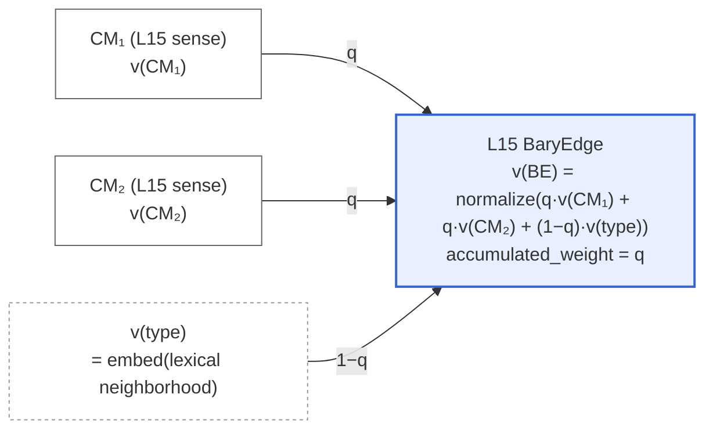
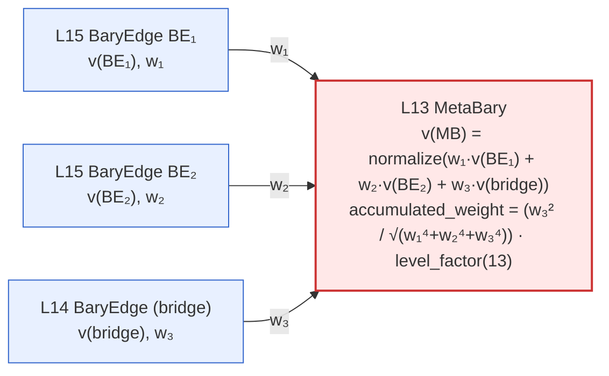

# BaryGraph

[](https://doi.org/10.5281/zenodo.20186500)

**A knowledge graph architecture for cross-domain relational retrieval, where every relationship is a first-class searchable object.**

BaryGraph borrows a principle from physics: in any system of two
masses, the barycenter — the shared center of mass — is as real as
the masses themselves. It has a position, it has properties, and it
governs how the two bodies relate.

Standard vector retrieval treats relationships as thin edges: a label
and a weight between two nodes. The relationship itself has no
position in the retrieval space. BaryGraph promotes every relationship
to a **BaryEdge** — a stored document with its own 768-dimensional
embedding, its own structural position in a forest hierarchy, and its
own behavior in nearest-neighbor search. Above the leaf levels,
BaryEdges themselves recurse into higher-order triads (**MetaBary**),
constructed algebraically without further embedding calls.

The architecture is designed for **cross-domain bridging**: surfacing
structural connections between concepts that flat vector search
cannot construct, because the connection lives in a relational
neighborhood the embedding model never sees. The proof-of-concept in
this repository instantiates BaryGraph on the kaikki.org English
Wiktionary corpus — chosen because it has pre-labeled relations,
free ground truth, and human-readable results — but the architecture
is corpus-agnostic.

The current build contains **6.66 million documents**: 1.74M sense
nodes, 1.44M word nodes, 2.50M leaf-level BaryEdges, and ~989k
MetaBary triads spanning levels L13 to L10.

---

## The Architecture in One Diagram

Every connection is a triad of three entities: two CMs (knowledge
nodes) and a BaryEdge between them. The BaryEdge's vector is a
weighted blend of its two parent vectors plus a context vector.

**Panel A — atomic L15 BaryEdge construction:**



Above L14, BaryEdges become CMs for new triads. Two BaryEdges are
bridged by a third (the bridge), forming a MetaBary. The diagram
shape is identical to panel A — the same `normalize(w₁·a + w₂·b +
w₃·c)` construction — but the inputs are now stored BaryEdges rather
than nodes and an external embed call.

**Panel B — L13 MetaBary recursion:**



Higher-level MetaBary construction is pure algebra on stored
vectors — zero embedding calls — and authority compounds through
each level via the `accumulated_weight` scaling.

Full architecture specification: [`BaryGraph_Kaikki_PoC_v0_6.md`](BaryGraph_Kaikki_PoC_v0_6.md).

---

## What This Buys You

Three things flat vector search does not provide:

**Relationships are retrievable as objects.** A query for *"the
connection between river and floodplain"* can return the BaryEdge
that pairs them, ranked in the same index as the words themselves.

**Cross-domain bridges are discoverable on demand.** Filter retrieval
by MetaBary level (`level: 10..13`) and the result set contains
triads that bridge different semantic neighborhoods. A live example:
an L13 MetaBary collects three senses whose glosses all literally
say *"in an opposite direction"* — `contraoriented`, `antialigning`
(tagged *physics*), and `antialignment` — reifying *oppositional
orientation as a kind*, a concept that has no single word in English.

**Higher-order patterns exist as first-class documents.** An L11
MetaBary at one coordinate of the index encodes a four-word,
three-edge pattern as a single retrievable object. For example, one
L11 MetaBary bridges biological taxis (`hydrotaxis`, `hydrotropism`,
`rheotaxis` — tagged biology) with physical dynamics (`hydrodynamic`,
`hydrophysics`, `water-powered`) under the bridge concept
*aquiferous system / hydrophysics*. The two children share no
vocabulary; a flat embedding model would never make them neighbors.
The MetaBary's vector position encodes the relationship.

---

## The Live Graph

[Statistics from the production build, May 2026.]

**Document counts:**

| Level | Document type | Count |
|---|---|---:|
| 15 | Sense node | 1,737,696 |
| 14 | Word node | 1,437,051 |
| 15 | BaryEdge | 1,107,392 |
| 14 | BaryEdge | 1,390,405 |
| 13 | MetaBary | 495,641 |
| 12 | MetaBary | 424,994 |
| 11 | MetaBary | 34,894 |
| 10 | MetaBary | 34,891 |

**L14 edge-type distribution** (what kaikki actually encodes):

| edge_type | count | share | kaikki source |
|---|---:|---:|---|
| `extends` | 889,819 | 64.0% | `derived[]`, `related[]` |
| `contradicts` | 293,306 | 21.1% | `antonyms[]` |
| `same_phenomenon` | 150,845 | 10.8% | `synonyms[]`, `coordinate_terms[]` |
| `is_instance_of` | 51,964 | 3.7% | `hypernyms[]`, `hyponyms[]` |
| `applies_to` | 4,471 | 0.3% | `meronyms[]`, `holonyms[]` |

The 200× spread from `extends` to `applies_to` is what Wiktionary
contributors record. The architecture does not balance it; balancing
would falsify the corpus.

---

## Evaluation

Two complementary evaluation modes, both with reproducible artifacts
in the repository.

### Substrate Coherence (Standard Benchmarks)

We ran SimLex-999, WordSim-353-Similarity, and WordSim-353-Relatedness
against the graph to confirm it behaves coherently as a vector
retrieval substrate. The headline finding (Spearman ρ vs gold):

| metric | SimLex-999 | WS-353-Sim | WS-353-Rel |
|---|---:|---:|---:|
| `mean_vec_score` (raw cosine) | −0.04 | +0.08 | −0.04 |
| `edge_overlap` | **+0.32** | **+0.31** | +0.17 |
| `word_overlap` | **+0.32** | **+0.53** | **+0.25** |

Raw vector cosine does not predict human similarity judgment.
*Structural* metrics — how many neighbors two words share in the
graph — correlate substantially (p < 10⁻¹⁵). This is consistent with
the cross-domain bridging design: the graph encodes structural
relatedness through shared-neighborhood topology, not pointwise
embedding proximity.

Of 999 SimLex pairs, 22 are connected through a MetaBary triad
(L11–L13). These are dominated by antonyms — `floor/ceiling`,
`absence/presence`, `forget/learn`, `god/devil` — pairs that score
low for *similarity* but are deeply *related*. Antonyms cluster
tightly in distributional embedding space; only structural retrieval
surfaces them as related.

Raw CSVs: [`evaluation/results/`](evaluation/results/).

### Cross-Domain Probe Traces

Concept queries spanning unrelated domains, each evaluated by reading
the top retrieved MetaBary and tracing the bridge mechanism. Examples:

| Probe | MetaBary level | Bridge surfaced |
|---|---|---|
| Trust in distributed systems | L13 | verificationism (philosophy) ↔ proof by exhaustion (logic), bridged by *trust, but verify* |
| Grief vs depression | none | informative absence: clusters disjoint, matches DSM-5 |
| Octopus and engineering sensors | L13 | *neuroarchitecture* / *smartdust* — biology to distributed engineering |
| Collagen folding and linguistics | L13 | *plicature* (folding etymology) + *hypotaxis/parataxis* (structural motif) |
| Radioactive decay and lost words | L10 | *collapsed/decayed/declined/demised/disintegrated/reduc't/reduced* — Poisson-process state loss across physics and historical linguistics |

The L10 case is architecturally distinctive: a bridge composed
entirely of register-varied past-participle decay verbs names an
abstract structural process that both physics and historical
linguistics instantiate. No individual bridge word is remarkable; the
cluster as a whole names a property that lives *between* domains.
Flat vector retrieval cannot construct this kind of bridge — the
embedding space has no axis for "verbs co-occurring with
reduction-of-state across domains."

Probe details are in the companion paper (see [Citation](#citation)).

---

## Stack

Everything runs locally. Zero cloud dependencies. Zero cost.

| Component | Role |
|---|---|
| MongoDB Community 8.x + mongot | Storage, graph traversal, vector search |
| nomic-embed-text-v1.5 | 768-dim embeddings (sense glosses, L14 type sentences only) |
| llama.cpp / ollama | Embedding runtime |

Hardware for full ingestion: 8–16 GB GPU VRAM, 32–64 GB RAM, 150–200
GB disk, 8+ cores. Total cost: zero.

---

## How It Works

```
kaikki-en.jsonl
      │
      ▼
  1. Parse              extract senses from JSONL
  2. Embed              embed sense glosses → 768-dim vectors
  3. Insert nodes       L15 sense + L14 word nodes → MongoDB
  4. L15 BaryEdges      cosine-driven greedy matching + orphan re-entry
  5. Word vectors       BE-centroid + orphan senses (no embedding call)
  6. L14 BaryEdges      kaikki relations in fermion order (antonyms first)
  7. L14 orphan re-entry  unpaired words absorbed into existing BEs
  8. MetaBary L13→L1    bridge-driven triads, recursive
  9. MetaBary extension  threshold relaxation, per-level floor
 10. Index               build mongot vector indexes
      │
      ▼
  queryable in ~8–14 hours
```

The embedding model runs only at stages 2 and 6 — on L15 sense glosses
and a fixed set of L14 type sentences. Every higher-level vector is
algebra on those anchors. This is what makes the architecture cheap
to scale.

Full pipeline details: [`BaryGraph_Kaikki_PoC_v0_6.md` §8](BaryGraph_Kaikki_PoC_v0_6.md).

---

## Getting Started

```bash
# 1. Install (Python 3.11+)
cp .env.example .env
make install                    # pip install -e ".[dev]"

# 2. Start local services (project-owned Mongo on port 27117)
make up                         # MongoDB Community 8 + mongot
make up-gpu                     # + ollama for GPU embedding, optional
docker exec barygraph-ollama ollama pull nomic-embed-text:v1.5

# 3. Download kaikki English dump (idempotent, resumable)
make fetch-kaikki

# 4. Preflight check
make preflight                  # mongo, ollama, embed dim, dump size, disk

# 5. Run ingestion stages
python -m scripts.s01_parse
python -m scripts.s02_embed
python -m scripts.s03_insert_nodes
python -m scripts.s04_l15_edges
python -m scripts.s05_word_vectors
python -m scripts.s06_l14_edges
python -m scripts.s07_orphan_reentry
python -m scripts.s08_metabary
python -m scripts.s09_extend
python -m scripts.s10_index
# or: make pipeline
```

### Querying

The simplest query — finding the structural connection between two
concepts:

```python
from lib.db import db

# Cross-domain MetaBary search at L13
results = db.barygraph.aggregate([
    { "$vectorSearch": {
        "index": "barygraph_vector",
        "path": "vector",
        "queryVector": embed("structural property shared across domains"),
        "numCandidates": 200,
        "limit": 10,
        "filter": { "doc_type": "baryedge", "level": { "$in": [10, 11, 12, 13] } }
    }}
])
```

Each result is a MetaBary triad. Walk the `cm1_id` and `cm2_id`
fields (which may themselves be BaryEdges) to recover the four-word,
three-edge structure. Walk `parent_edge_id` for upward hierarchy.

---

## Project Structure

```
bary-vector/
├── README.md                          # this file
├── BaryGraph_Kaikki_PoC_v0_6.md       # full architecture spec (canonical)
├── pyproject.toml
├── docker-compose.yml                 # MongoDB (+ mongot) and ollama
├── Makefile
├── .env.example
├── data/
│   └── kaikki-en.jsonl                # download from kaikki.org (not in repo)
├── pipeline_state/                    # resumability checkpoints (gitignored)
├── indexes/
│   └── vector_index.json
├── lib/
│   ├── config.py  log.py  checkpoint.py  db.py
│   ├── embed.py
│   ├── bary_vec.py                    # bary_vec / metabary / word_vector formulas
│   └── disambiguate.py                # _dis1 + cosine sense assignment
├── scripts/
│   ├── _base.py                       # shared CLI bootstrap + `bary` dispatcher
│   ├── s01_parse.py ... s10_index.py
│   ├── dev/make_fixture.py
├── evaluation/results/                # benchmark CSVs
└── tests/
    ├── fixtures/kaikki-sample.jsonl
    ├── unit/
    └── integration/
```

---

## Development

```bash
make lint        # ruff + mypy
make test        # unit tests (no services)
make test-int    # integration tests (requires `make up`)
```

CI (GitHub Actions) runs lint + unit on every push, and an
integration smoke test against a MongoDB service container using fake
embed backends — no GPU required.

---

## Status

- [x] Architecture specification ([v0.6](BaryGraph_Kaikki_PoC_v0_6.md))
- [x] Ingestion pipeline implementation
- [x] Live build (6.66M documents)
- [x] Substrate-coherence evaluation (SimLex, WordSim)
- [x] Cross-domain probe protocol
- [x] Companion paper (Zenodo pilot, in progress)
- [ ] Structure MetaBary primitive (Phase 2 — cross-cutting non-forest connections)
- [ ] Multi-language extension (Phase 2)

---

## Background

BaryGraph treats the connection between two entities as a first-class
object — a barycenter in the geometric sense — with its own position,
its own weight, and its own semantic content. The name "BaryEdge"
comes from this: an edge that is itself a barycenter. The
architecture is corpus-agnostic; this repository instantiates it on
a dictionary because the relations are explicit and the ground truth
is free, but the same primitive applies to any corpus with structured
relations between entities.

---

## Citation

If you use BaryGraph or build on this work, please cite the
companion paper:

> Perepelytsya, O. (2026). *BaryGraph: Relationships as First-Class Vectors for Cross-Domain Retrieval.* Zenodo.
[](https://doi.org/10.5281/zenodo.20186500)

---

*BaryGraph · 2026*
